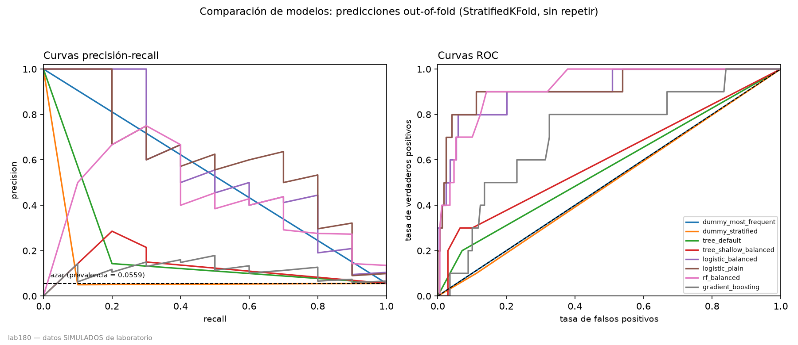

# predictive-maintenance-pipeline

Clasificación de riesgo de fallo en maquinaria industrial a partir de sensores.

**Tesis del repositorio:** un pipeline de mantenimiento predictivo evaluado
honestamente sobre dos datasets de tamaño radicalmente distinto, demostrando
que la métrica ingenua —la accuracy— miente en ambos. El repo no vende un
modelo. Vende criterio.

Todos los números de este README se leen de `reports/eda_lab180.json`, generado
por `pdm-cli eda --dataset lab180`. Ningún número está escrito a mano.

## Dataset: `lab180`

⚠️ **Datos SIMULADOS de laboratorio**, no mediciones de campo. `data/raw/lab180/Lab1_engineering_failures.csv`
— 180 filas, 6 columnas (5 sensores + variable objetivo `failure`).

### Tabla descriptiva

| atributo | n | nulos | %nulos | min | max | media | mediana | desv. típica |
|---|---|---|---|---|---|---|---|---|
| temperature_c | 176 | 4 | 2.2222 | 47.00 | 89.80 | 67.8102 | 67.950 | 7.6651 |
| vibration_mm_s | 176 | 4 | 2.2222 | **-0.34** | 9.59 | 4.2438 | 4.295 | 1.3349 |
| pressure_bar | 176 | 4 | 2.2222 | 4.27 | 10.19 | 6.7630 | 6.750 | 1.1330 |
| hours_since_maintenance | 180 | 0 | 0.0000 | 20.00 | 896.00 | 473.1889 | 440.000 | 262.3427 |
| load_percent | 180 | 0 | 0.0000 | 31.50 | 100.00 | 71.0900 | 71.400 | 14.4342 |

### La anomalía: vibración negativa

La fila **82** registra `vibration_mm_s = -0.34`. Una amplitud RMS de vibración
no puede ser negativa: es un imposible físico, no un valor extremo. Esa fila va
a **cuarentena**, no se imputa — imputar un sensor que miente sería fabricar un
dato, no rescatar uno perdido.

### Balance de clases

- `failure`: `no` = 170, `yes` = 10.
- **Prevalencia = 5.5556 %.**
- **Accuracy del clasificador trivial mayoritario = 94.4444 %** — el número que
  debe ir delante de cualquier accuracy que este repositorio reporte más
  adelante. Un modelo con menos de 94.4444 % de accuracy es peor que no hacer
  nada.

### Asociación univariante (AUC de Mann-Whitney)

| atributo | AUC | p-valor | dirección |
|---|---|---|---|
| vibration_mm_s | 0.8503 | 0.0002 | directa (la más fuerte) |
| temperature_c | 0.7259 | 0.0167 | directa |
| hours_since_maintenance | 0.7218 | 0.0187 | directa |
| load_percent | 0.6682 | 0.0746 | **no significativa** |
| pressure_bar | 0.2515 | 0.0085 | **inversa** |

`pressure_bar` con AUC < 0.5 significa que los fallos ocurren a presión
**baja**, no alta: compatible con fuga o pérdida de lubricación/fluido
hidráulico.

### Correlaciones

Todas las correlaciones de Pearson entre atributos tienen **|r| < 0.10**
(máximo 0.0972, entre `vibration_mm_s` y `load_percent`). Las cinco variables
son mutuamente independientes — una señal de que el dataset es simulado: en
maquinaria física, carga → temperatura → viscosidad del lubricante → vibración
forman una cadena causal acoplada.

### Figuras


*La barra `yes` es 5.5556 % del total; la línea discontinua marca 94.4444 %,
el accuracy que logra no hacer nada.*

![Mapa de correlación entre sensores, escala fija en [-1, 1]](reports/figures/lab180/correlacion.png)
*Plano por construcción: la celda más oscura fuera de la diagonal es 0.097 —
las cinco variables son mutuamente independientes.*


*`vibration_mm_s` es donde la clase `yes` (naranja) se separa más de la `no`
(azul); en `pressure_bar` el naranja cae hacia valores más bajos.*


*Cada punto es una observación: con 10 positivos, la caja `yes` no promedia
más precisión de la que hay puntos para sostenerla — y se ve el -0.34 de
`vibration_mm_s` por debajo de cero.*

## Contrato de datos

Ningún dato entra al pipeline sin pasar antes por un contrato ejecutable
(`src/predictive_maintenance/schema.py`, un `pandera.DataFrameModel`): rangos
físicamente posibles por sensor y las dos categorías válidas de `failure`. La
fila que lo incumple no se corrige ni se descarta en silencio — va a
[`data/quarantine/`](data/quarantine/), con el motivo exacto por el que se
rechazó, para que alguien la revise.

`pdm-cli validate --dataset lab180` ejecuta el contrato y vuelca el resultado
a `reports/validation_lab180.json`:

- **180 filas leídas → 179 válidas, 1 en cuarentena.**
- Motivo: `vibration_mm_s=-0.34 incumple greater_than_or_equal_to(0.0)`
  (fila 82).

### Por qué cuarentena y no imputación

`vibration_mm_s = -0.34` es un imposible físico: una amplitud RMS de
vibración no puede ser negativa, así que no es un valor extremo que suavizar,
es un sensor que miente. Imputar ese valor —con la media, la mediana o un
modelo— habría fabricado un dato a partir de una lectura que sabemos que está
mal, y ese dato fabricado habría entrado a entrenar un modelo como si fuera
una medición real.

Si no la hubiéramos visto, la fila habría entrado tal cual al split de
entrenamiento/test: un valor negativo en una columna que después se escala y
se pasa a una regresión logística o un árbol no lanza ningún error, así que el
error no se detecta comparando un `Pipeline` contra un contrato — se detecta
prácticamente porque alguien mira el mínimo de una tabla descriptiva a mano
(CLAUDE.md §6.1). Con un contrato ejecutable, esa comparación deja de depender
de que alguien se acuerde de mirar.

Ningún otro atributo de `lab180` viola su rango físico: la única fila en
cuarentena es la 82, y **avisos de calidad: ninguno** — la prevalencia
(5.5556 %), los nulos por columna (máximo 2.22 %) y los duplicados (0) están
todos dentro de los umbrales de aviso de `config/default.yaml`.

## ¿Son reales estos datos?

**No. El auditor de plausibilidad (`src/predictive_maintenance/plausibility.py`)
dictamina: `probablemente sintético`.**

El veredicto combina dos firmas fuertes, deterministas, escritas a
`reports/plausibility_lab180.json`:

1. **Independencia mutua total.** En una máquina real, carga → temperatura →
   viscosidad del lubricante → vibración forman una cadena causal acoplada:
   se espera |r| ≥ 0.15 entre algún par de sensores. La correlación máxima
   observada entre `vibration_mm_s` y `load_percent` es **0.0972**, muy por
   debajo del umbral. Ningún par de atributos está acoplado.
2. **Patrón de nulos demasiado regular.** 12 nulos, repartidos en **exactamente
   4, 4 y 4** entre `temperature_c`, `vibration_mm_s` y `pressure_bar`, que
   **jamás se solapan** en la misma fila (ninguna fila tiene 2 nulos o más). Un
   sensor real falla por causas independientes entre sí; que el recuento
   coincida exacto entre tres columnas distintas es la firma de un generador,
   no de un fallo de instrumentación.

Como evidencia adicional, de apoyo —no decisiva por sí sola—, el auditor
también comprueba la distribución del último dígito decimal de cada sensor
(`digit_distribution`): en los cinco atributos es compatible con muestreo
uniforme (`chi²`, p > 0.05 en todos), consistente con datos generados por
`numpy.random.uniform` y redondeo, no con la cuantización de un sensor físico
de bajo coste.

Esto no descalifica `lab180` como ejercicio: lo define. Sirve de
**contraejemplo** en este repositorio — qué NO se puede concluir con pocos
datos simulados — y nunca se presenta como resultado principal (CLAUDE.md
§13).

## Resultados

Todos los números de esta sección salen de `reports/metrics_lab180.json`,
generado por `pdm-cli train --dataset lab180`, y de la tabla que ese mismo
comando escribe en `reports/results_lab180.md`. Ningún número está escrito a
mano.

**Solo se entrena sobre las filas que pasan el contrato de datos** (CLAUDE.md
§2.9): 179 de las 180 filas de `lab180` — la fila 82 (`vibration_mm_s =
-0.34`) sigue en cuarentena, nunca entra al split. Por eso la prevalencia real
de entrenamiento es 10/179 = 5.5866 %, no el 5.5556 % de la tabla descriptiva
de §6 (calculada sobre las 180 filas crudas). Es una diferencia de una fila;
se explica en el CHECKPOINT de esta fase.

Protocolo: `RepeatedStratifiedKFold(n_splits=5, n_repeats=10, random_state=42)`
para la tabla de medias; un único `StratifiedKFold(n_splits=5, shuffle=True,
random_state=42)` para las matrices de confusión y las curvas PR/ROC (CLAUDE.md
§8, §8.2) — repetir ahí contaría la misma fila varias veces con predicciones de
modelos distintos.

| modelo | PR-AUC | ROC-AUC | recall | precision | bal.acc | accuracy | Brier |
|---|---|---|---|---|---|---|---|
| dummy_most_frequent | 0.0559 | 0.5000 | 0.0000 | 0.0000 | 0.5000 | 0.9441 | 0.0559 |
| dummy_stratified | 0.0714 | 0.4832 | 0.0800 | 0.0400 | 0.4832 | 0.8413 | 0.1587 |
| tree_default | 0.1214 | 0.5684 | 0.1900 | 0.1293 | 0.5684 | 0.9045 | 0.0955 |
| tree_shallow_balanced | 0.1781 | 0.6438 | 0.4000 | 0.1654 | 0.6363 | 0.8461 | 0.1191 |
| **logistic_balanced** | **0.6748** | 0.9189 | **0.7800** | 0.4191 | 0.8524 | 0.9168 | 0.0667 |
| logistic_plain | 0.7153 | 0.9292 | 0.3500 | 0.4500 | 0.6700 | 0.9542 | 0.0329 |
| **rf_balanced** | 0.6117 | **0.9254** | **0.1400** | 0.2200 | 0.5659 | 0.9441 | 0.0411 |
| gradient_boosting | 0.4387 | 0.8496 | 0.1400 | 0.1700 | 0.5576 | 0.9285 | 0.0657 |

Como en CLAUDE.md §8.1, las dos filas `dummy_*` van primero: cualquier modelo
por debajo de su accuracy (0.9441) es peor que no hacer nada. `logistic_plain`
—sin `class_weight`— es la base de la calibración y el umbral por coste de la
Fase 4 (CLAUDE.md §9.2); no está en la tabla original de §8.1.

### La matriz de confusión agregada, sin repetir

Sobre el mismo `StratifiedKFold(5, shuffle=True, seed 42)` de CLAUDE.md §8.2,
cada fila recibe una predicción out-of-fold exactamente una vez:

| modelo | TN | FP | FN | TP | recall | accuracy | IC Wilson del recall |
|---|---|---|---|---|---|---|---|
| tree_default | 157 | 12 | 8 | 2 | 0.20 | 0.8883 | [0.057, 0.510] |
| tree_shallow_balanced | 152 | 17 | 7 | 3 | 0.30 | 0.8659 | [0.108, 0.603] |
| rf_balanced | 168 | 1 | 10 | **0** | 0.00 | 0.9385 | [0.000, 0.278] |
| logistic_balanced | 157 | 12 | 2 | **8** | 0.80 | 0.9218 | **[0.490, 0.943]** |

El IC del recall de `logistic_balanced` coincide EXACTO con CLAUDE.md §8.2
([0.490, 0.943]) — 8 aciertos sobre 10 positivos no depende de cuántas filas
haya en el resto del dataset. El de `rf_balanced` también coincide: **0 de 10
positivos detectados**, igual que en CLAUDE.md.

### CV anidada de demostración

`evaluate.nested_cv` (Vabalas et al. 2019) sobre `logistic_balanced`, barriendo
`C ∈ {0.01, 0.1, 1, 10}` con `GridSearchCV` interno de 3 folds en cada uno de
los 50 folds externos: PR-AUC media 0.7016, ROC-AUC media 0.9254. El valor de
`C` elegido con más frecuencia es el más pequeño (`C=0.01`, en 27 de 50 folds
externos) — con 10 positivos, el interno tiende a preferir la regularización
más fuerte disponible en la rejilla.


*Predicciones out-of-fold de un único `StratifiedKFold(5)`: la línea de azar
del panel PR está en la prevalencia real (0.0559), no en 0.5. `rf_balanced`
ordena casi tan bien como `logistic_balanced` en ambos paneles — su problema no
es la curva, es el umbral por defecto (ver más abajo).*

## Por qué la accuracy miente en este problema

**El clasificador que nunca predice un fallo acierta el 94.41 % de las veces.**
Cualquier accuracy de la tabla anterior que no supere ese número es, literalmente,
peor que no hacer nada.

El resultado más contraintuitivo de la tabla está en dos filas: `rf_balanced`
tiene el mejor ROC-AUC (0.9254) casi empatado con `logistic_balanced` (0.9189),
pero detecta muchísimos menos fallos — 0.14 de recall medio en la CV repetida,
y **0 de 10** en la matriz de confusión agregada de una sola pasada. Frente a
eso, `logistic_balanced` tiene un ROC-AUC ligeramente menor pero un recall de
0.78 (8 de 10 en la matriz agregada) y, sobre todo, un PR-AUC casi el triple
(0.6748 frente a 0.6117).

**Cómo se formula correctamente ese contraste** (importa, porque es el
resultado titular del repo): el ROC-AUC mide **calidad de ordenación** y es
independiente del umbral — `rf_balanced` ordena los 179 casos casi tan bien
como `logistic_balanced`, y eso es real. Pero al umbral por defecto (0.5),
`rf_balanced` comprime las probabilidades de sus positivos por debajo de esa
línea, así que casi nunca clasifica a nadie como fallo. El ROC-AUC mide lo
primero y lo premia; el recall mide lo segundo y lo castiga. **No es que el
umbral explique el ROC-AUC de 0.9254: el umbral explica el recall de 0.14 (o de
0 en la matriz agregada).** Convertir esa probabilidad bien ordenada en una
decisión de mantenimiento con un umbral distinto de 0.5 es, precisamente, el
tema de la Fase 4.

## Decisiones de diseño

- **Por qué NO SMOTE ni oversampling sintético.** Con 10 positivos, interpolar
  vecinos sintéticos entre ellos no añade información: repite el ruido de
  muestreo de esos 10 casos con una precisión falsa. `pipeline.py` no incluye
  ningún paso de reequilibrado de clases; el desbalance se maneja con
  `class_weight="balanced"` (en los modelos `_balanced`) o, en la Fase 4, con
  un umbral de decisión distinto de 0.5 — nunca las dos cosas a la vez
  (CLAUDE.md §2.5).
- **Por qué NO un único holdout train/test.** Con 10 positivos, un split
  80/20 deja ~2 positivos en test: un solo acierto o fallo mueve el recall 50
  puntos porcentuales. `RepeatedStratifiedKFold(5, n_repeats=10)` promedia 50
  particiones distintas — el intervalo de confianza que sale de ahí
  (`bootstrap_ci`) es la única forma honesta de decir cuánto se puede confiar
  en la media. Varoquaux, G. (2018). *Cross-validation failure: small sample
  sizes lead to large error bars.* NeuroImage 180: 68-77.
- **Por qué PR-AUC y no ROC-AUC como métrica primaria.** La sección anterior
  es el ejemplo: con 94 % de la clase mayoritaria, el ROC-AUC puede ser alto
  mientras el modelo es inútil en la práctica (`rf_balanced`). El PR-AUC
  penaliza los falsos positivos en relación con los verdaderos positivos, no
  con los verdaderos negativos, que sobran. Saito, T., Rehmsmeier, M. (2015).
  *The Precision-Recall Plot Is More Informative than the ROC Plot When
  Evaluating Binary Classifiers on Imbalanced Datasets.* PLOS ONE 10(3):
  e0118432.
- **Por qué CV repetida y no una sola CV de 5 folds.** Un único reparto en
  folds, con 10 positivos, es una muestra de tamaño 10 de por sí: repetir el
  reparto 10 veces con semillas distintas (mismo `random_state` global, otra
  partición interna) es lo que permite calcular un intervalo de confianza que
  refleje la varianza del propio proceso de partición, no solo la del modelo.
- **Por qué CV anidada para elegir hiperparámetros.** Elegir `C` (o
  `max_depth`, o `n_estimators`) mirando la métrica en el mismo fold que se
  reporta como resultado final produce una estimación optimista: el proceso de
  selección de modelo se ajusta al ruido de ESA partición. `evaluate.nested_cv`
  separa el `GridSearchCV` interno (elige hiperparámetros) del fold externo
  (nunca visto por el interno) que se usa para medir. Vabalas, A. et al.
  (2019). *Machine learning algorithm validation with a limited sample size.*
  PLOS ONE 14(11): e0224365.

## En construcción

Esto cubre las Fases 1, 2 y 3 (andamiaje + EDA + contrato de datos + auditor de
plausibilidad + modelado con validación honesta). Todavía faltan: calibración
de probabilidades, umbral de decisión por coste, límites estadísticos
explícitos (estabilidad del árbol, presupuesto de potencia) y el segundo
dataset (`ai4i2020`). Nada de lo que sigue está escrito todavía a propósito —
no hay número que reportar sin haberlo medido.

## Desarrollo

```bash
uv sync
make lint
make test
make eda
make validate
make train
```

Ver `CLAUDE.md` para las reglas del proyecto.

## Licencia

MIT. Ver [`LICENSE`](LICENSE).
