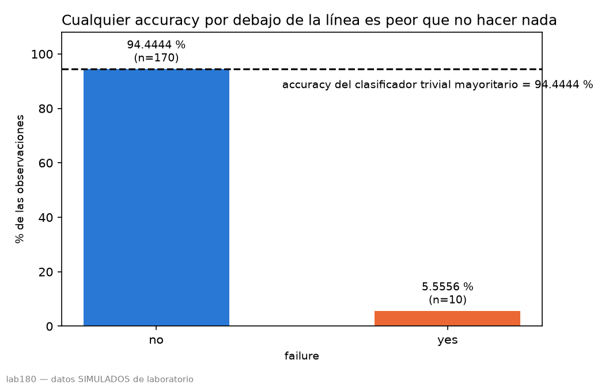
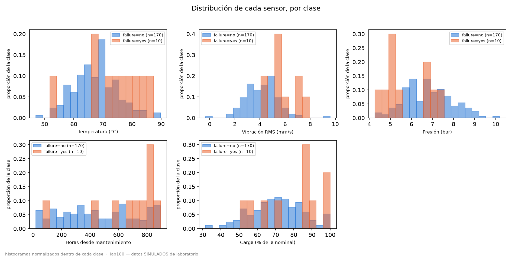
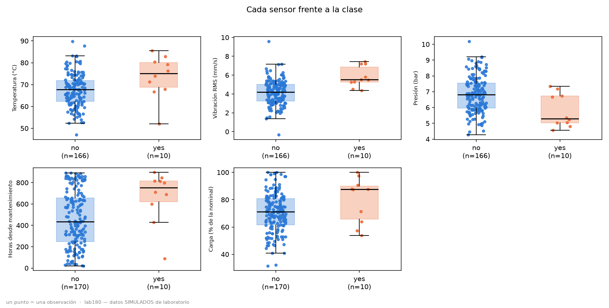

# predictive-maintenance-pipeline

Clasificación de riesgo de fallo en maquinaria industrial a partir de sensores.

**Tesis del repositorio:** un pipeline de mantenimiento predictivo evaluado
honestamente sobre dos datasets de tamaño radicalmente distinto, demostrando
que la métrica ingenua —la accuracy— miente en ambos. El repo no vende un
modelo. Vende criterio.

Todos los números de este README se leen de `reports/eda_lab180.json`, generado
por `pdm-cli eda --dataset lab180`. Ningún número está escrito a mano.

## Dataset: `lab180`

⚠️ **Datos SIMULADOS de laboratorio**, no mediciones de campo. `data/raw/lab180/Lab1_engineering_failures.csv`
— 180 filas, 6 columnas (5 sensores + variable objetivo `failure`).

### Tabla descriptiva

| atributo | n | nulos | %nulos | min | max | media | mediana | desv. típica |
|---|---|---|---|---|---|---|---|---|
| temperature_c | 176 | 4 | 2.2222 | 47.00 | 89.80 | 67.8102 | 67.950 | 7.6651 |
| vibration_mm_s | 176 | 4 | 2.2222 | **-0.34** | 9.59 | 4.2438 | 4.295 | 1.3349 |
| pressure_bar | 176 | 4 | 2.2222 | 4.27 | 10.19 | 6.7630 | 6.750 | 1.1330 |
| hours_since_maintenance | 180 | 0 | 0.0000 | 20.00 | 896.00 | 473.1889 | 440.000 | 262.3427 |
| load_percent | 180 | 0 | 0.0000 | 31.50 | 100.00 | 71.0900 | 71.400 | 14.4342 |

### La anomalía: vibración negativa

La fila **82** registra `vibration_mm_s = -0.34`. Una amplitud RMS de vibración
no puede ser negativa: es un imposible físico, no un valor extremo. Esa fila va
a **cuarentena**, no se imputa — imputar un sensor que miente sería fabricar un
dato, no rescatar uno perdido.

### Balance de clases

- `failure`: `no` = 170, `yes` = 10.
- **Prevalencia = 5.5556 %.**
- **Accuracy del clasificador trivial mayoritario = 94.4444 %** — el número que
  debe ir delante de cualquier accuracy que este repositorio reporte más
  adelante. Un modelo con menos de 94.4444 % de accuracy es peor que no hacer
  nada.

### Asociación univariante (AUC de Mann-Whitney)

| atributo | AUC | p-valor | dirección |
|---|---|---|---|
| vibration_mm_s | 0.8503 | 0.0002 | directa (la más fuerte) |
| temperature_c | 0.7259 | 0.0167 | directa |
| hours_since_maintenance | 0.7218 | 0.0187 | directa |
| load_percent | 0.6682 | 0.0746 | **no significativa** |
| pressure_bar | 0.2515 | 0.0085 | **inversa** |

`pressure_bar` con AUC < 0.5 significa que los fallos ocurren a presión
**baja**, no alta: compatible con fuga o pérdida de lubricación/fluido
hidráulico.

### Correlaciones

Todas las correlaciones de Pearson entre atributos tienen **|r| < 0.10**
(máximo 0.0972, entre `vibration_mm_s` y `load_percent`). Las cinco variables
son mutuamente independientes — una señal de que el dataset es simulado: en
maquinaria física, carga → temperatura → viscosidad del lubricante → vibración
forman una cadena causal acoplada.

### Figuras


*La barra `yes` es 5.5556 % del total; la línea discontinua marca 94.4444 %,
el accuracy que logra no hacer nada.*

![Mapa de correlación entre sensores, escala fija en [-1, 1]](reports/figures/lab180/correlacion.png)
*Plano por construcción: la celda más oscura fuera de la diagonal es 0.097 —
las cinco variables son mutuamente independientes.*


*`vibration_mm_s` es donde la clase `yes` (naranja) se separa más de la `no`
(azul); en `pressure_bar` el naranja cae hacia valores más bajos.*


*Cada punto es una observación: con 10 positivos, la caja `yes` no promedia
más precisión de la que hay puntos para sostenerla — y se ve el -0.34 de
`vibration_mm_s` por debajo de cero.*

## En construcción

Esta es la Fase 1 (andamiaje + EDA). Todavía **no existe ningún modelo entrenado
ni resultado de validación**: eso llega en fases posteriores, con
`RepeatedStratifiedKFold` sobre `lab180`, calibración de probabilidades, umbral
por coste y el segundo dataset (`ai4i2020`). Nada de lo que sigue está escrito
todavía a propósito — no hay número que reportar sin haberlo medido.

## Desarrollo

```bash
uv sync
make lint
make test
make eda
```

Ver `CLAUDE.md` para las reglas del proyecto.

## Licencia

MIT. Ver [`LICENSE`](LICENSE).
