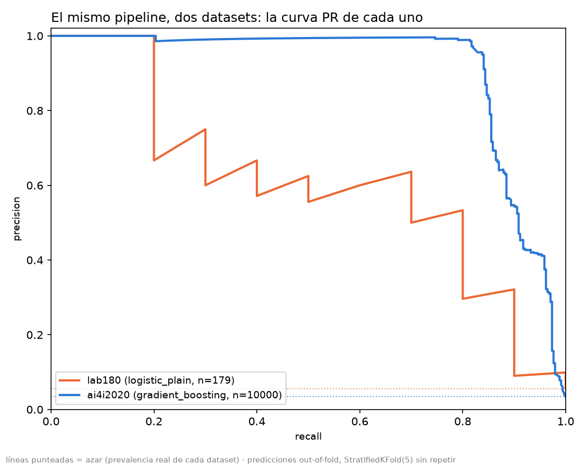
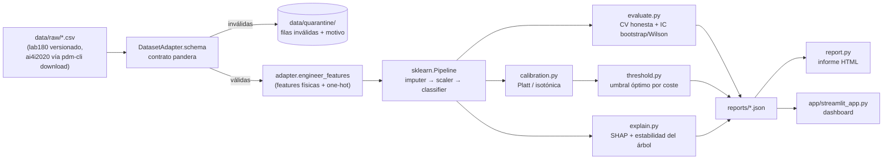

# predictive-maintenance-pipeline

[](https://github.com/ajmedinaa-gif/predictive-maintenance-pipeline/actions/workflows/ci.yml)

[](LICENSE)

Clasificación de riesgo de fallo en maquinaria industrial a partir de
sensores: un pipeline de mantenimiento predictivo evaluado honestamente sobre
dos datasets de tamaño radicalmente distinto, demostrando que la métrica
ingenua —la accuracy— miente en ambos. El repo no vende un modelo. Vende
criterio.

**Dashboard en vivo:** por desplegar en Streamlit Community Cloud (ver
[§ Quickstart](#quickstart) para levantarlo en local mientras tanto; las
instrucciones de despliegue exacto están en [§ Streamlit Community
Cloud](#desplegar-el-dashboard-en-streamlit-community-cloud)).
**Informe HTML:** se publica automáticamente en cada push a `main` vía
GitHub Pages una vez activado en *Settings → Pages* del repositorio, en
`https://ajmedinaa-gif.github.io/predictive-maintenance-pipeline/`.
**Model card:** [`MODEL_CARD.md`](MODEL_CARD.md).

## Resultado principal

Todos los números de esta tabla salen de `reports/comparison.json`, generado
por `pdm-cli compare` a partir de `reports/metrics_*.json` y
`reports/calibration_*.json` ya medidos sobre los dos datasets. Ningún número
está escrito a mano (hay un test que lo verifica:
`tests/test_readme_correspondence.py`).

| | `lab180` (179 filas válidas, simulado) | `ai4i2020` (10 000 filas, real — UCI id=601) |
|---|---|---|
| positivos | 10 (5.59 %) | 339 (3.39 %) |
| **accuracy del clasificador trivial** | **94.41 %** | **96.61 %** |
| mejor modelo por PR-AUC (informativo) | `logistic_plain` — PR-AUC 0.7153 | `gradient_boosting` — PR-AUC 0.9108 |
| **modelo de la decisión** (mismo en ambos, §9.2) | `logistic_plain` + Platt | `logistic_plain` + Platt |
| umbral óptimo por coste | 0.141 | 0.084 |
| recall a ESE umbral (aciertos/positivos) | 8/10 | 267/339 |
| **IC de Wilson del recall, al umbral óptimo** | **[0.490, 0.943] — 45 pp de ancho** | **[0.741, 0.828] — 9 pp de ancho** |
| ahorro del umbral óptimo sobre t=0.5 | 64.7 % | 40.7 % |

Como manda la regla dura del proyecto, la fila del clasificador trivial va
siempre presente: cualquier accuracy que no la supere es peor que no hacer
nada. Las cuatro últimas filas son siempre el mismo modelo
(`logistic_plain` + Platt, la ruta fija del proyecto: sin balanceo → calibrar
→ optimizar umbral), evaluado a **su propio umbral óptimo, nunca a 0.5** — la
fila "mejor modelo por PR-AUC" es aparte y solo informativa.

**La fila que hay que leer dos veces es la del IC de Wilson: con 179 filas,
un intervalo de 45 puntos porcentuales hace que "recall 0.49" y "recall 0.94"
sean estadísticamente indistinguibles — no sirve para decidir nada en
producción. Con 10 000 filas, el mismo cálculo da un intervalo de 9 puntos:
accionable.** No es que `ai4i2020` tenga "mejores datos" en un sentido
abstracto — tiene 34 veces más positivos, y eso es, literalmente, lo único
que estrecha un intervalo de Wilson.


*Curvas PR del modelo de mejor PR-AUC de cada dataset (`logistic_plain` y
`gradient_boosting`), predicciones out-of-fold de un único `StratifiedKFold(5)`.
La de `lab180` es dentada porque cada uno de sus 10 positivos mueve la curva
de un salto; la de `ai4i2020` es suave y se mantiene muy por encima de su
propia línea de azar.*

## Por qué la accuracy miente en este problema

**El clasificador que nunca predice un fallo acierta el 94.41 % de las veces
en `lab180`, y el 96.61 % en `ai4i2020`.** Cualquier accuracy por debajo de
esa línea es, literalmente, peor que no hacer nada — y la línea sube (no
baja) cuanto más desbalanceada está la clase, independientemente de cuántas
filas tenga el dataset.

El resultado más contraintuitivo de `lab180` (CLAUDE.md §8.1) es este
contraste, mejor leído como dos filas una al lado de la otra que como un
número suelto:

| modelo | ROC-AUC | recall (umbral 0.5) |
|---|---|---|
| `rf_balanced` | **0.9254** | 0.14 |
| `logistic_balanced` | 0.9189 (peor) | **0.78** |

`rf_balanced` tiene el ROC-AUC más alto de los dos — y aun así detecta muchos
menos fallos. El ROC-AUC mide **calidad de ordenación** y es **independiente
del umbral**: `rf_balanced` ordena los 179 casos casi tan bien como
`logistic_balanced`, y eso es real. Pero al umbral por defecto (0.5),
`rf_balanced` comprime las probabilidades de sus positivos por debajo de esa
línea, así que casi nunca clasifica a nadie como fallo. El ROC-AUC mide lo
primero y lo premia; el recall mide lo segundo y lo castiga. **El umbral
explica el recall de 0.14, NO el ROC-AUC de 0.9254.** Convertir esa
probabilidad bien ordenada en una decisión de mantenimiento con un umbral
distinto de 0.5 —el tema de la sección de calibración, más abajo— es
precisamente lo que le falta a este resultado para dejar de ser
contraintuitivo.

## Diagrama del pipeline



`pipeline.py`, `evaluate.py` y `calibration.py` son exactamente el mismo
código para `lab180` y `ai4i2020`: la única pieza específica de cada dataset
es su `DatasetAdapter` (CLAUDE.md §13.1).

## Quickstart

```bash
git clone https://github.com/ajmedinaa-gif/predictive-maintenance-pipeline.git && cd predictive-maintenance-pipeline
docker compose up pipeline    # genera reports/ para los dos datasets (tarda unos minutos)
docker compose up dashboard   # http://localhost:8501
```

Sin Docker: `uv sync && make run && make dashboard` (ver [§
Desarrollo](#desarrollo)).

**Tamaño de la imagen, medido por el job `docker` de CI (no estimado):
921 MiB (966 348 736 bytes).** Muy por encima del objetivo original de
< 400 MB — ver la entrada correspondiente en [§ Decisiones de diseño](#decisiones-de-diseño-y-alternativas-descartadas).

## Estructura del repo

```
src/predictive_maintenance/
  datasets.py     DatasetAdapter (protocolo + lab180/ai4i2020), registro de datasets
  schema.py       contratos pandera (rangos físicos por sensor)
  data.py         validación + cuarentena
  eda.py          análisis exploratorio puro (sin dibujar, sin imprimir)
  plausibility.py auditor de plausibilidad (¿sintético o real?)
  pipeline.py     fábrica de sklearn.Pipeline (imputer → scaler → classifier)
  evaluate.py     CV honesta, IC bootstrap, IC de Wilson
  calibration.py  Platt / isotónica, comparación de variantes
  threshold.py    umbral de decisión por coste
  explain.py      SHAP, estabilidad de la raíz del árbol
  power.py        presupuesto estadístico, curva de aprendizaje
  figures.py      todas las figuras PNG (matplotlib, backend Agg)
  report.py       payload JSON + informe HTML (jinja2)
  cli.py          pdm-cli (typer): download/eda/validate/run/train/
                  calibrate/explain/limits/compare/report
app/streamlit_app.py   dashboard (5 pestañas, lee reports/*.json)
tests/                 cobertura >= 80 %
config/                default.yaml (rutas, CV, semilla), costs.yaml
data/raw/lab180/       versionado; data/raw/ai4i2020/ se descarga aparte
notebooks/             anexo académico (ejecutado con Jupyter real)
reports/               *.json + *.html + figures/ (PNG sí versionados)
.github/workflows/     ci.yml, pages.yml
Dockerfile, docker-compose.yml, Makefile
```

## Los dos datasets, en detalle

### `lab180`: el contraejemplo

⚠️ **Datos SIMULADOS de laboratorio**, no mediciones de campo —
`data/raw/lab180/Lab1_engineering_failures.csv`, 180 filas, 6 columnas (5
sensores + `failure`).

**Balance de clases:** `no` = 170, `yes` = 10 → prevalencia 5.5556 %,
accuracy trivial 94.4444 %.

**La anomalía:** la fila 82 registra `vibration_mm_s = -0.34`. Una amplitud
RMS de vibración no puede ser negativa: es un imposible físico, no un valor
extremo. Esa fila va a **cuarentena** (`pdm-cli validate --dataset lab180`:
180 filas leídas → 179 válidas, 1 en cuarentena), no se imputa — imputar un
sensor que miente sería fabricar un dato, no rescatar uno perdido.

**Asociación univariante** (AUC de Mann-Whitney, ordenada por distancia a
0.5): `vibration_mm_s` (0.8503, la más fuerte), `pressure_bar` (0.2515,
**inversa** — presión baja, no alta, precede al fallo), `temperature_c`
(0.7259), `hours_since_maintenance` (0.7218), `load_percent` (0.6682, **no
significativa**, p=0.075).

**Correlaciones:** todas |r| < 0.10 (máximo 0.0972, entre `vibration_mm_s` y
`load_percent`) — las cinco variables son mutuamente independientes, la
primera firma de que el dataset es sintético.

**¿Son reales estos datos? No.** El auditor de plausibilidad
(`plausibility.py`) dictamina `probablemente sintético`, combinando dos
firmas fuertes y deterministas: independencia mutua total (arriba) y un
patrón de nulos demasiado regular (12 nulos, exactamente 4/4/4 entre
`temperature_c`/`vibration_mm_s`/`pressure_bar`, que jamás se solapan en la
misma fila, y ninguno cae en la clase minoritaria). Esto no descalifica
`lab180` como ejercicio: lo define como **contraejemplo** de lo que NO se
puede concluir con pocos datos.

**Resultados** (`RepeatedStratifiedKFold(5, n_repeats=10)`, CLAUDE.md §8):

| modelo | PR-AUC | ROC-AUC | recall | precision | bal.acc | accuracy | Brier |
|---|---|---|---|---|---|---|---|
| dummy_most_frequent | 0.0559 | 0.5000 | 0.0000 | 0.0000 | 0.5000 | 0.9441 | 0.0559 |
| dummy_stratified | 0.0714 | 0.4832 | 0.0800 | 0.0400 | 0.4832 | 0.8413 | 0.1587 |
| tree_default | 0.1214 | 0.5684 | 0.1900 | 0.1293 | 0.5684 | 0.9045 | 0.0955 |
| tree_shallow_balanced | 0.1781 | 0.6438 | 0.4000 | 0.1654 | 0.6363 | 0.8461 | 0.1191 |
| **logistic_balanced** | **0.6748** | 0.9189 | **0.7800** | 0.4191 | 0.8524 | 0.9168 | 0.0667 |
| logistic_plain | 0.7153 | 0.9292 | 0.3500 | 0.4500 | 0.6700 | 0.9542 | 0.0329 |
| **rf_balanced** | 0.6117 | **0.9254** | **0.1400** | 0.2200 | 0.5659 | 0.9441 | 0.0411 |
| gradient_boosting | 0.4387 | 0.8496 | 0.1400 | 0.1700 | 0.5576 | 0.9285 | 0.0657 |

`logistic_plain` —sin `class_weight`— es a la vez el **mejor PR-AUC** de la
tabla y el **mejor Brier** (0.0329): no es casualidad, es el único modelo
`plain` de los dos logísticos, el que no cuenta el desbalance dos veces. Es
exactamente el modelo que la Fase 4 designa para calibrar.

**Umbral por coste.** `config/costs.yaml` declara supuestos (CLP, no medidos
en campo): C_FN=10 000 000, C_FP=500 000, C_TP=1 500 000, C_TN=0. Como C_TP
no es cero, el umbral óptimo teórico no es `C_FP/(C_FP+C_FN)` (0.0476, mal)
sino `t* = (C_FP−C_TN)/((C_FP−C_TN)+(C_FN−C_TP)) = 0.0556`. Con
`logistic_plain` + Platt y el umbral optimizado **dentro de cada fold de
entrenamiento** (nunca sobre el fold de test):

| variante | Brier | PR-AUC | umbral empírico | ahorro sobre t=0.5 |
|---|---|---|---|---|
| logistic balanced | 0.0643 | 0.5918 | 0.470 | **−10.5 %** (empeora) |
| logistic plain (sin calibrar) | 0.0329 | **0.6232** | 0.150 | 46.3 % |
| **logistic plain + Platt** | 0.0370 | 0.5838 | 0.141 | **64.7 %** |
| logistic plain + isotónica | **0.0341** | 0.5582 | 0.091 | 24.0 % |

`logistic_plain` + Platt es la decisión del proyecto — no por tener el mejor
Brier ni el mejor PR-AUC de la tabla (no los tiene), sino por tener, con
diferencia, el mejor ahorro. `logistic_balanced` es el contraejemplo de la
regla dura "nunca combinar `class_weight="balanced"` con umbral por coste":
es la única fila cuyo coste al umbral "óptimo" es *peor* que quedarse en 0.5
— el desbalance ya se contó una vez al entrenar, y el umbral intenta
corregirlo otra vez sobre un fold de test que nunca vio.

**Sobre la fórmula teórica frente al barrido empírico:** aplicar t*=0.0556 a
las predicciones de `logistic_plain`+Platt cuesta 49.0 MM CLP; el umbral
empírico (0.126, por barrido simple) cuesta 29.0 MM CLP. El barrido gana
porque t* es óptimo solo si el modelo está **perfectamente** calibrado, y con
10 positivos ningún modelo lo está — la distancia entre ambos es, ella misma,
una medida de cuán lejos está la calibración real de la ideal, no un error de
ninguno de los dos cálculos.

**Qué NO podemos afirmar:**
- El IC de Wilson del recall (8/10 aciertos) es **[0.490, 0.943]** — 45 pp de
  ancho. "Recall 0.80" y "recall 0.50" son, con esta muestra, indistinguibles.
- La curva de aprendizaje de PR-AUC **no sube con más datos: es ruido**
  (bandas de hasta ±0.30, ver `reports/figures/lab180/learning_curve.png`).
- La raíz del árbol tampoco es estable: sobre 300 bootstraps estratificados,
  `vibration_mm_s` es la raíz solo el 56.0 % de las veces, no siempre
  (`tests/test_tree_stability.py` protege que esto se mantenga bajo 70 %).
- Tres métodos de importancia (SHAP, AUC univariante, estabilidad de la raíz)
  dan **tres órdenes distintos** — esperable con 10 positivos, no un error.
- Para estimar un recall de 0.80 con ±10 pp de margen harían falta 62
  fallos (~1110 ciclos de máquina a la prevalencia actual). Hoy hay 10.

### `ai4i2020`: la contraparte real

UCI id=601 (Matzka, 2020), descargado con
`ucimlrepo.fetch_ucirepo(id=601)` vía `pdm-cli download --dataset ai4i2020`
(medido, no un plan: 10 000 filas, 339 positivos = 3.39 %, sin nulos).
Features: `type` (L/M/H), `air_temperature_k`, `process_temperature_k`,
`rotational_speed_rpm`, `torque_nm`, `tool_wear_min` — más las derivadas
`power_w` (par × velocidad angular), `temp_delta_k` (disipación térmica) y
`wear_x_torque` (sobreesfuerzo acumulado), calculadas en
`AI4I2020Adapter.engineer_features`.

Los cinco modos de fallo documentados (TWF=46, HDF=115, PWF=95, OSF=98,
RNF=19) suman **373** sobre 339 positivos — verificado, no un error de
conteo: 348 filas tienen algún modo marcado (24 con dos o más a la vez), pero
solo 330 de esas 348 tienen también `machine_failure=1` (18 marcan un modo
sin activar el indicador general); las 9 filas que faltan hasta 339 tienen
`machine_failure=1` sin ningún modo marcado — una inconsistencia conocida del
dataset original entre el indicador general y sus cinco sub-modos. Ninguno de
los cinco modos entra como feature de modelado: son casi deterministas de
`machine_failure` y usarlos sería fuga del objetivo.

`plausibility.audit()` dictamina **"compatible con datos reales"** (frente a
"probablemente sintético" de `lab180`): la correlación máxima entre atributos
es 0.8761, entre `air_temperature_k` y `process_temperature_k` — muy por
encima del umbral de 0.15, confirmando que las features están físicamente
acopladas. `power_w` correlaciona con `PWF` de forma no lineal (en forma de
U: la desviación típica de `power_w` en filas con `PWF=1` es casi el triple
que en el resto — el mecanismo real es que PWF se dispara con potencia
anormalmente alta O baja); `temp_delta_k` correlaciona con `HDF` de forma
directa y clara (las 115 filas con `HDF=1` tienen `temp_delta_k` entre 7.6 y
8.6 K, frente a una media general de 10.0 K).

Resultados completos (`StratifiedKFold(5)` sin repetir, `pdm-cli run
--dataset ai4i2020`), calibración, explicabilidad y límites estadísticos:
ver `reports/report_ai4i2020.html` (autocontenido, se abre con cualquier
navegador sin instalar nada) o la pestaña correspondiente del dashboard.

## Decisiones de diseño y alternativas descartadas

- **`DatasetAdapter` en vez de un `ColumnTransformer` en el pipeline.** La
  alternativa obvia para manejar la columna categórica `type` de `ai4i2020`
  era meter un `ColumnTransformer` dentro de `pipeline.py`. Se descartó:
  `AI4I2020Adapter.engineer_features` ya entrega una matriz enteramente
  numérica (one-hot incluido) antes de que `X` llegue al `Pipeline`, así que
  `pipeline.py` no cambia una sola línea entre datasets — más simple, y
  confirmado por un test que exige que el primer paso del `Pipeline` sea
  literalmente un `SimpleImputer`.
- **`positive_label="yes"/"no"` en `ai4i2020`, nunca `"1"/"0"`.** Hallazgo
  real de la Fase 5: con etiquetas que son dígitos puros,
  `RandomForestClassifier(class_weight="balanced")` dispara un bug de
  scikit-learn en su recomputación interna de pesos por bootstrap
  (reproducible con un `RandomForestClassifier` plano, ajeno a este
  proyecto). Usar el mismo vocabulario que `lab180` lo evita de raíz.
- **Por qué NO SMOTE ni oversampling sintético.** Con 10 positivos,
  interpolar vecinos sintéticos repite el ruido de muestreo de esos 10 casos
  con precisión falsa. El desbalance se maneja con `class_weight="balanced"`
  o con un umbral de decisión distinto de 0.5 — nunca las dos cosas a la vez.
- **Por qué NO un único holdout train/test en `lab180`.** Un split 80/20 deja
  ~2 positivos en test: un solo acierto o fallo mueve el recall 50 puntos.
  `RepeatedStratifiedKFold(5, n_repeats=10)` promedia 50 particiones y
  permite un IC bootstrap que signifique algo (Varoquaux, 2018).
- **Por qué PR-AUC y no ROC-AUC como métrica primaria.** Con 94-97 % de la
  clase mayoritaria, el ROC-AUC puede ser alto mientras el modelo es inútil
  en la práctica (`rf_balanced` en `lab180`). El PR-AUC penaliza los falsos
  positivos en relación con los verdaderos positivos, no con los verdaderos
  negativos, que sobran (Saito & Rehmsmeier, 2015).
- **Por qué CV anidada para elegir hiperparámetros.** Elegir `C` mirando la
  métrica en el mismo fold que se reporta como resultado final produce una
  estimación optimista. `evaluate.nested_cv` separa el `GridSearchCV` interno
  del fold externo que nunca vio esos datos (Vabalas et al., 2019).
- **La comparación de "IC del recall" usa el modelo de mejor PR-AUC de cada
  dataset; la de "umbral óptimo" usa siempre `logistic_plain`+Platt en los
  dos.** Son comparables por razones distintas: la primera ilustra cuánto se
  estrecha un IC con más datos, sea cual sea el mejor modelo de cada uno; la
  segunda mide la misma ruta de decisión económica aplicada dos veces, y
  mezclar ambos criterios en una sola fila fue un error real de una versión
  anterior de esta tabla — corregido y documentado en el historial de commits.
- **Por qué `pdm-cli report` no dibuja nada.** `report.py` solo lee
  `reports/*.json` y las figuras PNG ya generadas por `figures.py` (las
  incrusta en base64). Mantiene la regla del proyecto de que el dibujo vive
  en un único módulo.
- **La imagen Docker pesa 921 MiB, no los <400 MB que se fijaron como
  objetivo al planificar esta fase — medido por el job `docker` de CI, no
  estimado.** Lo que la infla es el propio stack científico: scipy,
  scikit-learn, pandas y numpy de por sí; `llvmlite` + `numba` (que arrastra
  `shap`, la compilación JIT necesita el toolchain de LLVM empaquetado);
  `statsmodels`; y `streamlit` + `pyarrow` para el dashboard. No se redujo
  porque `streamlit`/`pyarrow` solo los usa el servicio `dashboard`, nunca el
  `pipeline` — partir el `Dockerfile` en dos imágenes finales que compartan
  el mismo stage `builder` (una para `pipeline`, sin Streamlit; otra para
  `dashboard`) bajaría el peso de la primera de forma significativa. Queda
  anotado como mejora pendiente, no hecha: no se ha tocado el `Dockerfile`
  para no comprometer sin probar en Docker de verdad, que esta máquina no
  tiene (CLAUDE.md §14.7). La conclusión sin adornos: es el coste real de
  empaquetar un stack científico completo en un contenedor, y se reporta
  medido en vez de fijar un objetivo cómodo después de conocer el número.
- **`reports/*.json` se versiona, a propósito, aunque sea una salida
  regenerable.** El dashboard desplegado en Streamlit Community Cloud clona
  el repo tal cual: sin estos 15 ficheros (628 KB en total) no tendría nada
  que leer al arrancar, y cuatro de sus cinco pestañas saldrían vacías (la
  de Decisión ni siquiera podría recalcular nada, porque las predicciones
  out-of-fold del modelo de decisión viven en `calibration_<dataset>.json`).
  Es la misma excepción que ya existía para los PNG de `reports/figures/`
  (CLAUDE.md §2.16), extendida por la misma razón.

  **El riesgo que esto introduce:** si el código de modelado cambia
  (una nueva versión de scikit-learn, un ajuste en `pipeline.py`, una
  métrica distinta) y nadie vuelve a ejecutar `make all`, los JSON
  comiteados quedan desfasados respecto al código — y con ellos, el README
  y el dashboard mienten en silencio, exactamente el tipo de error que este
  proyecto existe para evitar. Hoy la única red de seguridad es
  `tests/test_readme_correspondence.py`: compara números del README contra
  los JSON en disco, así que detecta si alguien edita el README a mano sin
  regenerar nada, pero **no** detecta si el JSON comiteado ya no coincide
  con lo que el código actual produciría. Lo siguiente sería un job de CI
  que regenere los reports y falle si difieren de los comiteados — no se
  implementó todavía porque las diferencias de coma flotante entre macOS
  (donde se generaron) y Linux (donde corre CI) harían ese chequeo
  inestable sin antes decidir una tolerancia numérica, y eso queda como
  trabajo pendiente, no resuelto a medias.

## Limitaciones

Ver [`MODEL_CARD.md`](MODEL_CARD.md) para el detalle completo: uso previsto,
uso fuera de alcance, y por qué el modelo entrenado sobre `lab180` en
particular **no debe desplegarse** tal cual (10 positivos, sin eje temporal,
IC del recall casi tan ancho como el rango [0,1]).

## Desplegar el dashboard en Streamlit Community Cloud

1. En [share.streamlit.io](https://share.streamlit.io), "New app" →
   conectar el repositorio `ajmedinaa-gif/predictive-maintenance-pipeline`,
   rama `main`.
2. **Main file path:** `app/streamlit_app.py`.
3. Streamlit Cloud instala desde `requirements.txt` (generado con
   `uv export --no-dev --no-hashes --format requirements-txt`, ya en la raíz
   del repo) — no usa `uv` ni `pyproject.toml` directamente.
4. El dashboard lee `reports/*.json` y `reports/figures/*`: como esos
   ficheros NO se versionan (se regeneran con el pipeline), hay que
   generarlos antes de desplegar y comprometerlos en una rama/tag específico
   para el deploy, o ejecutar el pipeline en un paso previo fuera de
   Streamlit Cloud (no tiene un paso de build propio). La forma más simple:
   generar `reports/` en local (`make run`) y hacer commit de ese contenido
   solo en la rama que apunta el deploy de Streamlit Cloud.
5. `.streamlit/config.toml` ya fija tema y modo *headless*; no requiere
   configuración adicional en la plataforma.

## Desarrollo

```bash
uv sync
make lint
make test
make run          # pipeline completo (lab180 + ai4i2020, descarga incluida)
make dashboard    # http://localhost:8501
```

Ver [`CONTRIBUTING.md`](CONTRIBUTING.md) para cómo se construyó el repo fase
por fase y las reglas duras del proyecto; [`CLAUDE.md`](CLAUDE.md) es la
fuente de verdad completa.

## Referencias

- Vabalas, A. et al. (2019). *Machine learning algorithm validation with a
  limited sample size.* PLOS ONE 14(11): e0224365.
- Saito, T., Rehmsmeier, M. (2015). *The Precision-Recall Plot Is More
  Informative than the ROC Plot When Evaluating Binary Classifiers on
  Imbalanced Datasets.* PLOS ONE 10(3): e0118432.
- Varoquaux, G. (2018). *Cross-validation failure: small sample sizes lead to
  large error bars.* NeuroImage 180: 68-77.
- Matzka, S. (2020). *Explainable Artificial Intelligence for Predictive
  Maintenance Applications.* IEEE CSCI — dataset AI4I 2020 (UCI id=601).

## Autor

[@ajmedinaa-gif](https://github.com/ajmedinaa-gif)

## Licencia

MIT. Ver [`LICENSE`](LICENSE).
